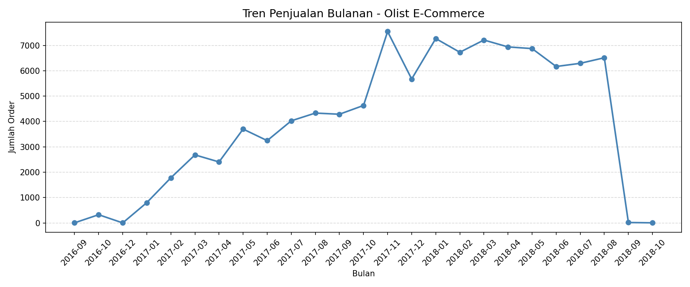
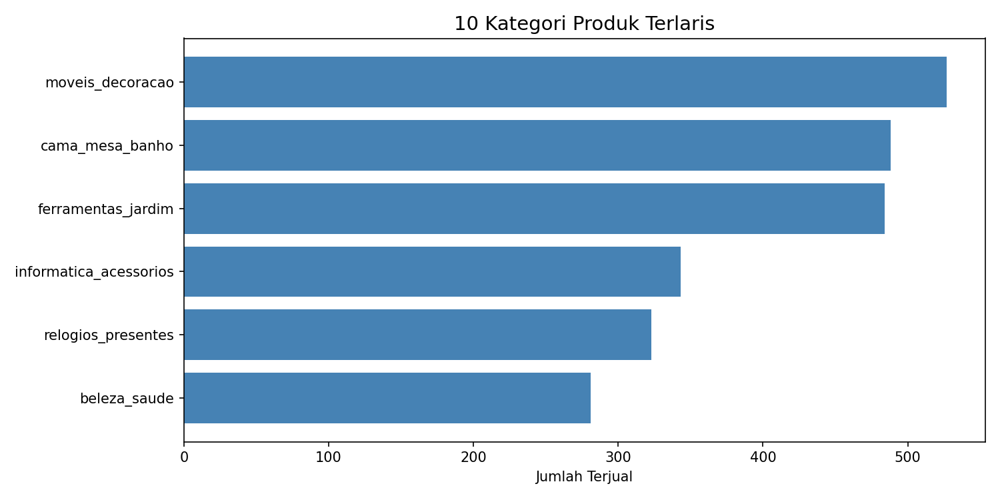

# 📊 Analisis Penjualan E-Commerce - Olist Brasil

Proyek analisis data penjualan e-commerce menggunakan dataset publik Olist Brasil.
Dibuat sebagai bagian dari portfolio Data Analyst.

---

## 🎯 Tujuan

- Menganalisis tren penjualan bulanan dari 2016–2018
- Mengidentifikasi 10 kategori produk terlaris
- Memvisualisasikan insight menggunakan grafik

---

## 📌 Insight Utama

- 📈 Penjualan tumbuh signifikan dari Sept 2016 hingga puncaknya Nov 2017 (~7.500 order/bulan)
- 🛋️ Kategori **furniture & dekorasi rumah** menjadi produk terlaris (527 item)
- 📉 Penjualan stabil di kisaran 6.000–7.000 order sepanjang 2018

---

## 🛠️ Tools & Library

| Tool             | Kegunaan                   |
| ---------------- | -------------------------- |
| Python           | Bahasa pemrograman utama   |
| Pandas           | Manipulasi & analisis data |
| Matplotlib       | Visualisasi grafik         |
| Jupyter Notebook | Environment analisis       |

---

## 📁 Struktur Folder

## 📁 Struktur Folder

    ecommerce-analysis/
    ├── data/
    │   ├── olist_orders_dataset.csv
    │   └── olist_order_items_dataset.csv
    ├── notebook/
    │   ├── analysis.ipynb
    │   ├── tren_penjualan.png
    │   └── produk_terlaris.png
    └── README.md

---

## 📊 Hasil Visualisasi

### Tren Penjualan Bulanan

### 10 Kategori Produk Terlaris

---

## 👤 Author

**Rafif Amrulloh**  
Teknik Informatika — STMIK LPKIA  
[GitHub](https://github.com/rafif-amrulloh)

